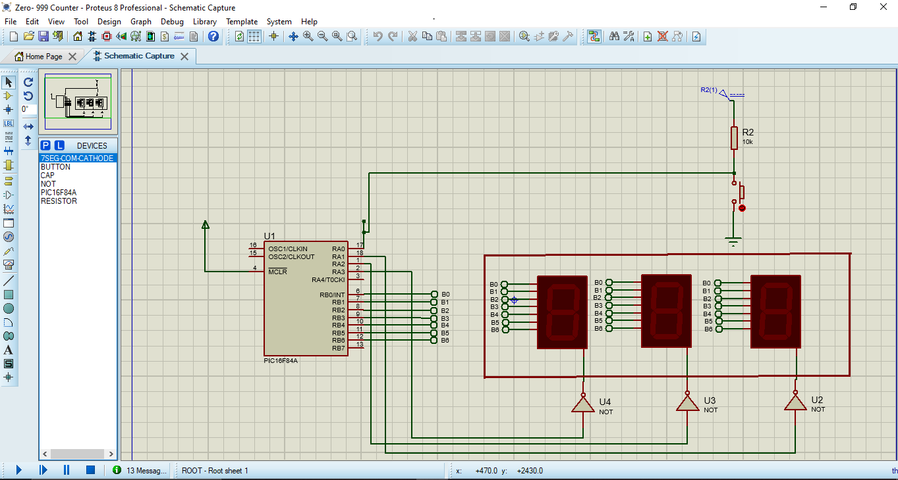
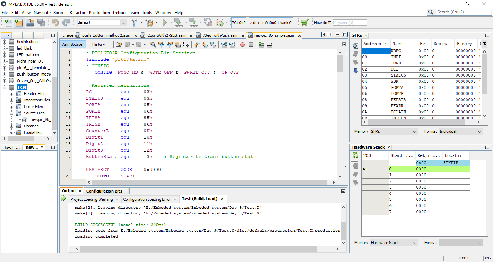

# PIC16F84A 000-999 Counter

A PIC16F84A assembly project for a push-button counter from `000` to `999`. The count is shown on three multiplexed seven-segment displays and stops at `999` when the limit is reached.

## Features

- PIC16F84A assembly firmware
- Three-digit multiplexed seven-segment display
- Active-low push-button input
- One count increment per button press
- Automatic units, tens, and hundreds carry
- Upper limit at `999`
- Active-high segment and digit-enable outputs

## Hardware assumptions

- MCU: PIC16F84A
- `RA0`: active-low push-button input
- `RA1`: units-digit enable
- `RA2`: tens-digit enable
- `RA3`: hundreds-digit enable
- `PORTB`: seven-segment segment data outputs
- Three seven-segment displays with multiplexed digit enables
- External pull-up for the button input

The segment lookup table uses the common active-high patterns for digits `0` through `9`. Confirm the display type, transistor polarity, and current-limiting resistors against the target circuit before programming hardware.

## Firmware flow

1. Configure `RA0` and `RA4` as inputs, `RA1`-`RA3` as outputs, and all `PORTB` pins as outputs.
2. Detect a new active-low button press using `ButtonState`.
3. Increment the units digit and propagate carries through tens and hundreds.
4. Ignore additional button presses once the displayed value reaches `999`.
5. Rapidly scan the three digits so they appear continuously illuminated.

## MPLAB X project

Build the source with the PIC16F84A device support package in MPLAB X IDE. The source includes `p16f84a.inc` and uses an HS oscillator configuration with watchdog, power-up timer, and code protection disabled.

## Source

- `count0-99With buttonPress_AssemblyCode.txt`: PIC16F84A assembly source
- `images/proteus-schematic.png`: Proteus wiring reference
- `images/mplab-x-build.png`: MPLAB X IDE build/debug reference
